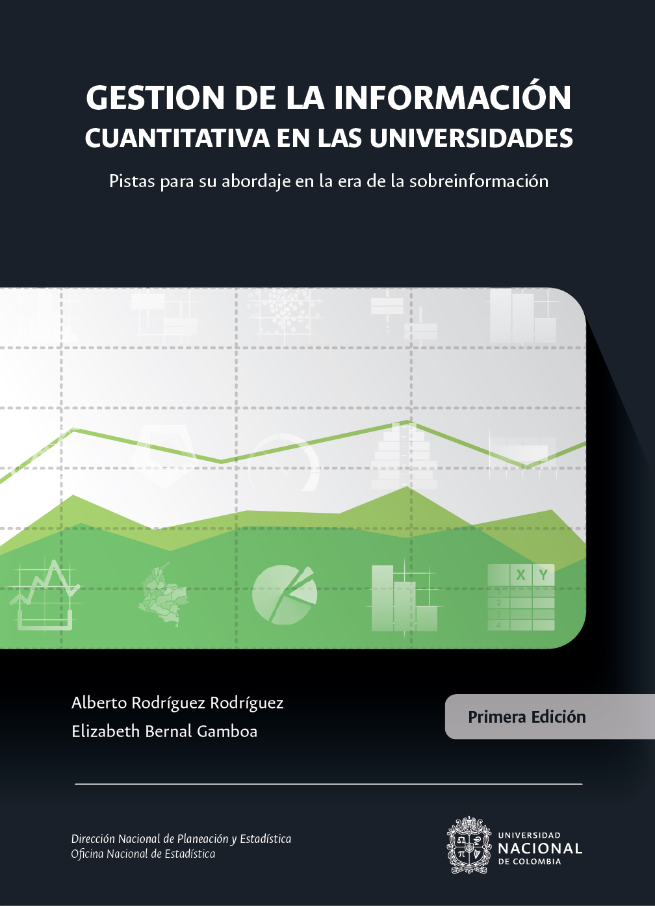

--- 
title: "Gestión de la información cuantitativa en las universidades"
subtitle: "Pistas para su abordaje en la era de la sobreinformación"
author: "<a href='http://unal.edu.co/' target='blank'> Universidad Nacional de Colombia</a> </br>  <a href= 'http://estadisticas.unal.edu.co/' target='blank'> Oficina Nacional de Estadística</a>"
date: "`r Sys.Date()`"
site: bookdown::bookdown_site
documentclass: krantz
bibliography: [book.bib]
biblio-style: apalike
link-citations: yes
colorlinks: yes
graphics: yes
lot: yes
lof: yes
fontsize: 11pt
mainfont: Palatino
url: 'https://estadisticaun.github.io/L_Conceptual/'
github-repo: estadisticaun/L_Conceptual
cover-image: imagenes/Portada Final.jpg
---


# Portada {-}

```{r fig.align='center', out.width='75%', fig.show='hold', echo=FALSE}

```
